# SwiftUI Beginner
Code Basics Elements for the Swift UI Beginner

## Text
```swift
Text("Hello SwiftUI")
```
<kbd>
  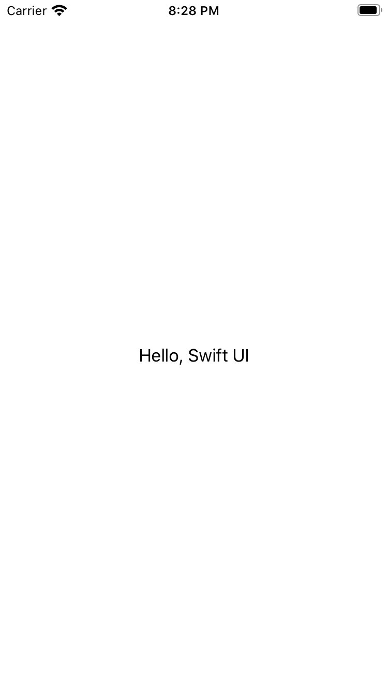 
</kbd>

## Image
```swift
Image(systemName:"clock")
```
<kbd>
  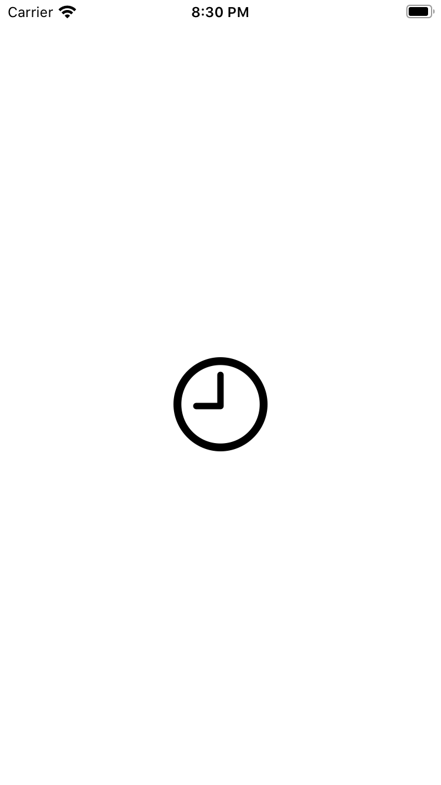 
</kbd>

## Button
```swift
Button("Click Me") { 
  // handle the tap
}
```
<kbd>
  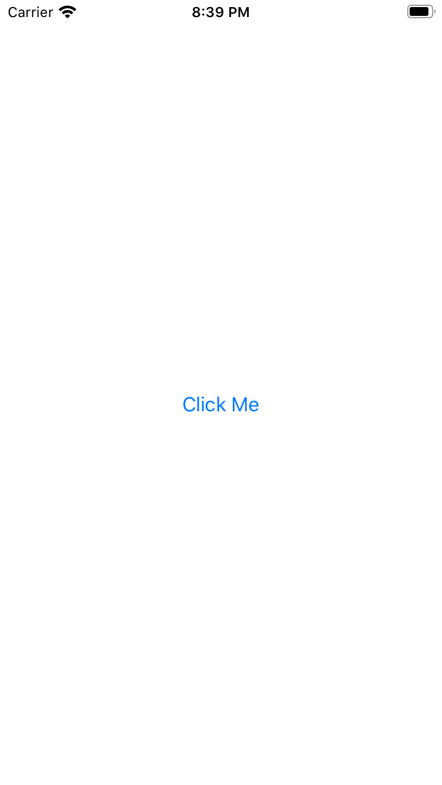 
</kbd>

## Toggle / Switch
```swift
@State var isToggle: Bool = false

Toggle(isOn: $isToggle) {
  Text("Toogle")
}
``` 
<kbd>
  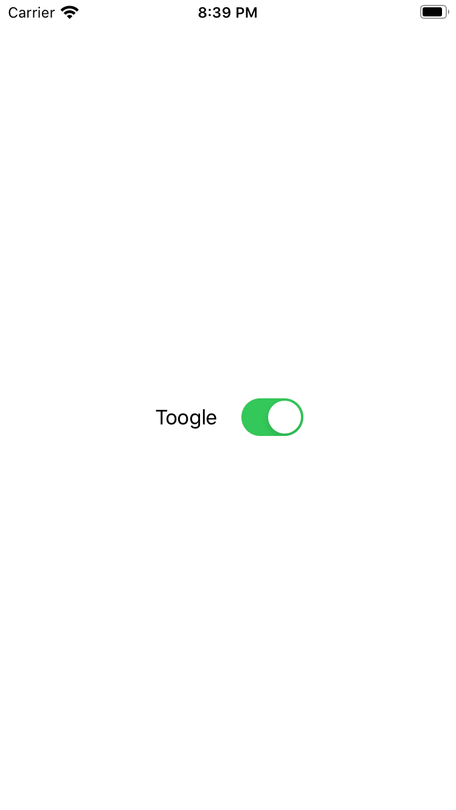 
</kbd>
        
## TextField
```swift     
@State var name = ""

TextField("Please Enter Name", text: $name)
  .textFieldStyle(RoundedBorderTextFieldStyle())
```
<kbd>
  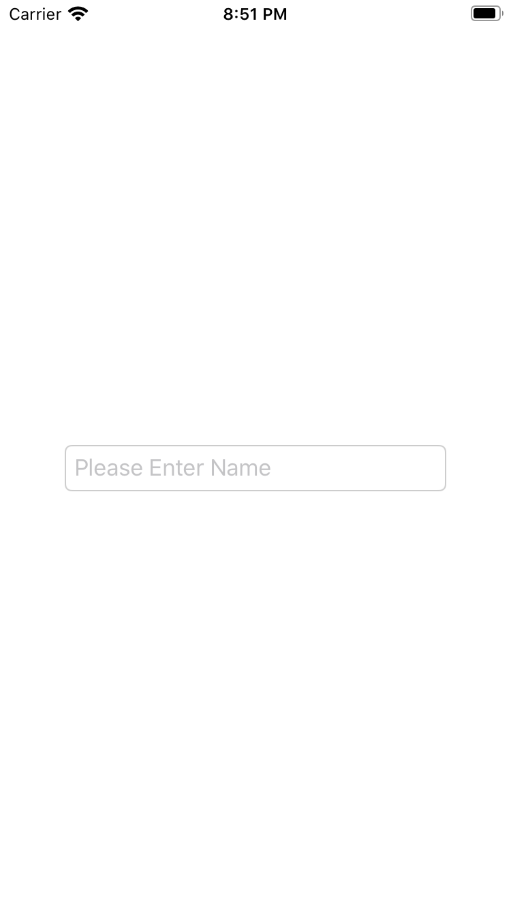 
</kbd>

## Slider
```swift
@State var slider: Float = 5.0

Slider(value: $slider, in: 0...10)
  .padding(.horizontal, 40)
```
<kbd>
   
</kbd>

## Stepper
```swift
@State var stepperValue = 5          

Stepper("Steps \(stepperValue)", value: $stepperValue, in: 0...10)
  .padding(.horizontal, 80)
```
<kbd>
  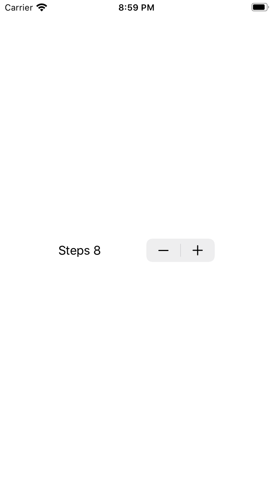 
</kbd>

## Picker
```swift
@State var weekDayIndex = 0
var weekDays = ["Sunday", "Monday", "Tuesday", "Wednesday", "Thursday", "Friday", "Saturday"]

Picker("Week Day", selection: $weekDayIndex) {
  ForEach(0..<weekDays.count) { index in
    Text(self.weekDays[index])
      .tag(index)
    }
}.padding(.horizontal, 80)
```
<kbd>
  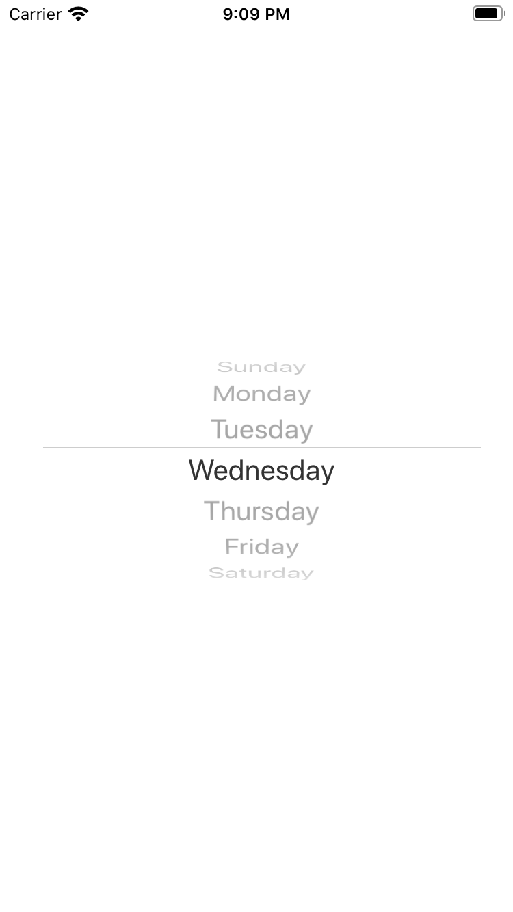 
</kbd>

## Segmented Control
```swift
@State var genreMusicIndex = 0
var genresMusic = ["Romantic", "Rock", "Electro", "Rap"]

Picker("Week Day", selection: $genreMusicIndex) {
  ForEach(0..<genresMusic.count) { index in
    Text(self.genresMusic[index])
      .tag(index)
    }
}
.pickerStyle(SegmentedPickerStyle())
.padding(.horizontal, 80)
```
<kbd>
  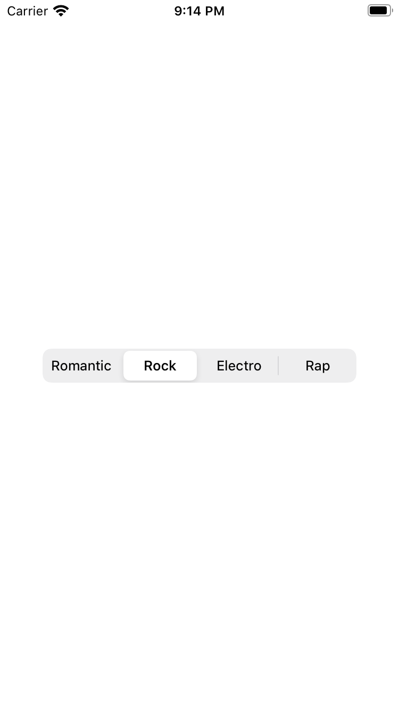 
</kbd>

## Date Picker
```swift
@State var dateOfBirth = Date()
 
DatePicker("Select Date of Birth", selection: $dateOfBirth, in: ...Date(), displayedComponents: [.date])
  .labelsHidden()
  .padding(.horizontal, 30)
```
<kbd>
  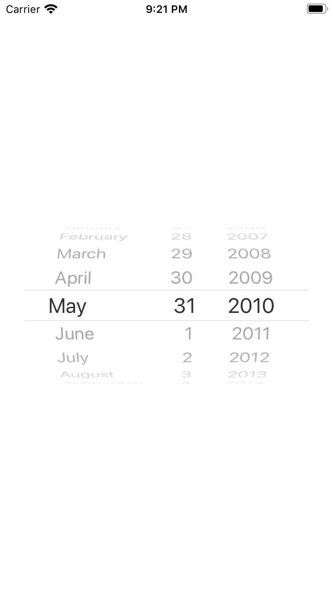 
</kbd>

## NavigationView and NavigationLink
```swift
NavigationView {
  NavigationLink("Navigation Link", destination: Text("Navigation Link Clicked"))
  .navigationBarTitle("Navigation Demo")
}
```
<kbd>
  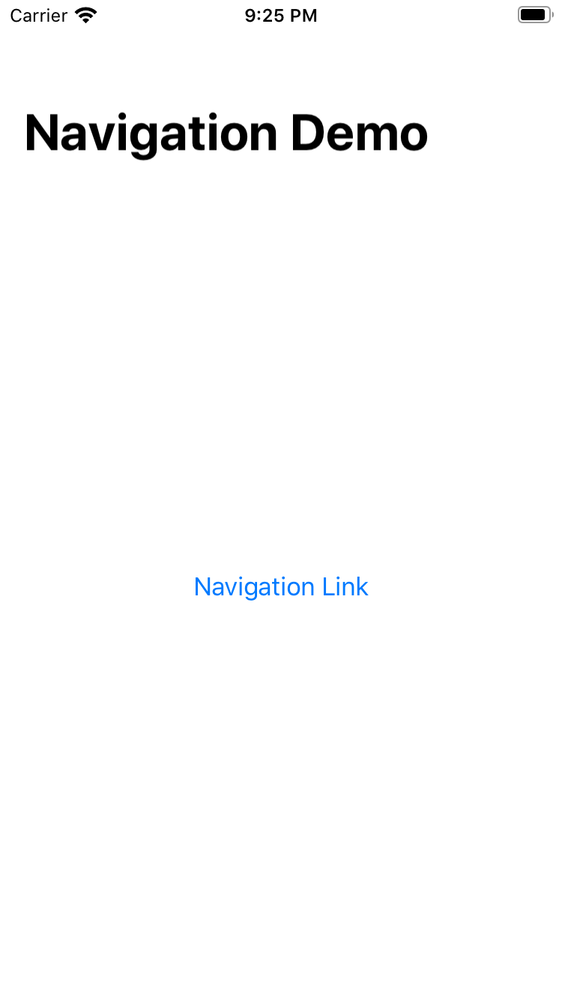 
</kbd>
&nbsp; &nbsp; &nbsp;
<kbd>
  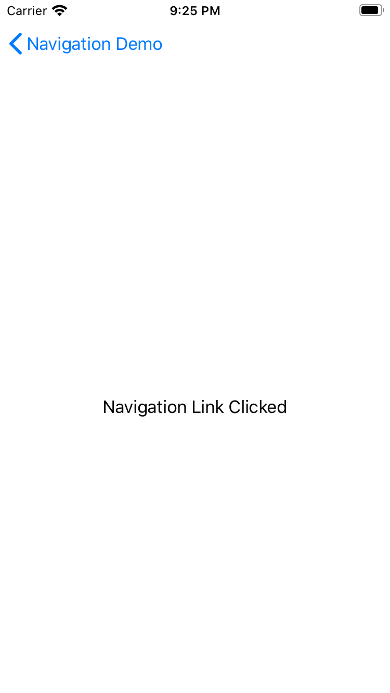 
</kbd>

## Tab Bar
```swift
TabView {
  Text("Home Screen")
    .tabItem({
      Image(systemName: "house.fill")
      Text("Home")
    })
    .tag(0)

  Text("Edit Screen")
    .tabItem ({
      Image(systemName: "pencil.circle.fill")
      Text("Edit")
    })
    .tag(1)

  Text("Notification Screen")
    .tabItem ({
      Image(systemName: "bell.fill")
      Text("Notification")
    })
    .tag(2)

  Text("More")
    .tabItem ({
      Image(systemName: "ellipsis.circle.fill")
      Text("More")
    })
    .tag(3)
}
```
<kbd>
  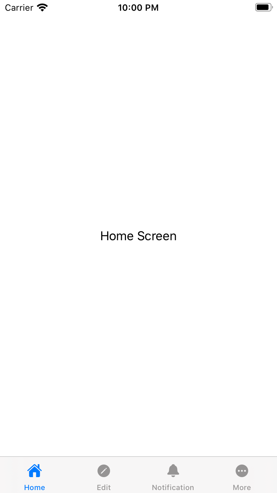 
</kbd>
&nbsp; &nbsp; &nbsp;
<kbd>
  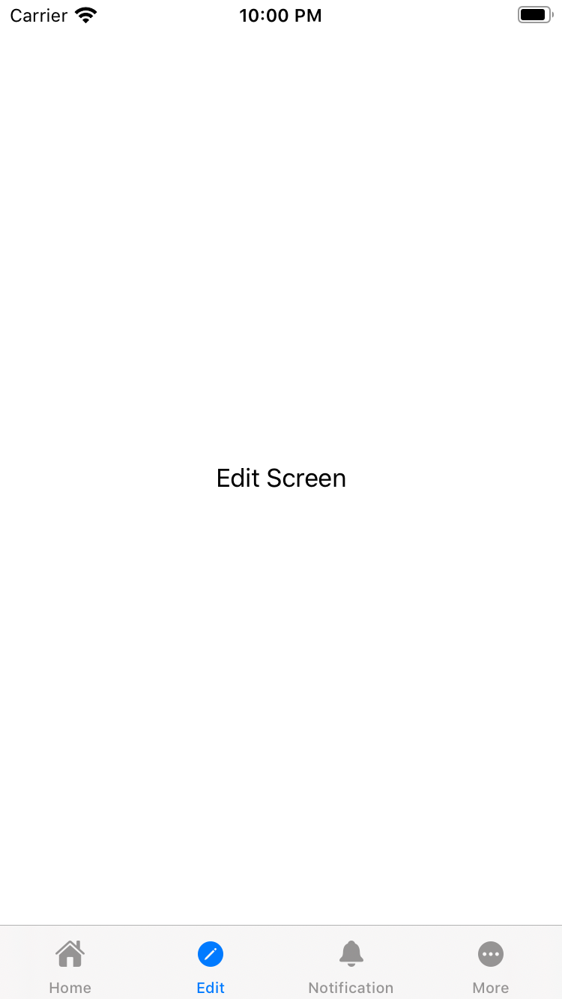 
</kbd>
&nbsp; &nbsp; &nbsp;
<kbd>
  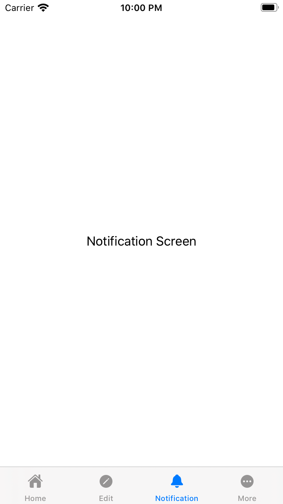 
</kbd>
&nbsp; &nbsp; &nbsp;
<kbd>
  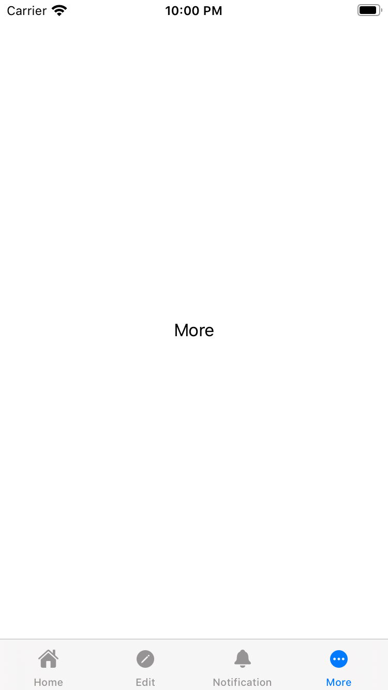 
</kbd>

        
